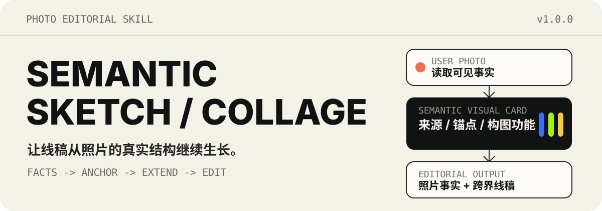
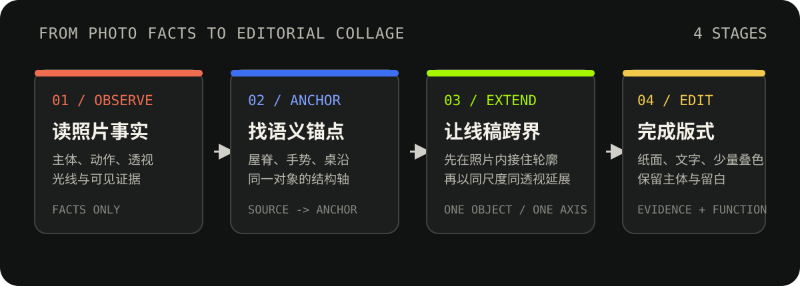
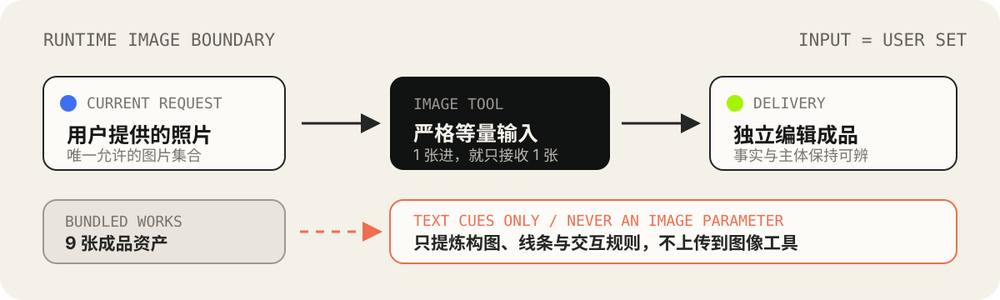

<p align="center">
  
</p>

<p align="center">
  将真实照片转化为手绘编辑拼贴、实验海报或 zine 图像。<br>
  照片保留事实，线稿沿真实结构跨界延展，文字只在有可靠来源时进入画面。
</p>

<p align="center">
  <a href="#核心方法">核心方法</a> ·
  <a href="#快速开始">快速开始</a> ·
  <a href="#输入边界">输入边界</a> ·
  <a href="#包内容">包内容</a> ·
  <a href="#验证">验证</a>
</p>

---

## 它做什么

`semantic-sketch-collage` 是一个面向照片编辑式创作的 Codex Skill。它先辨认照片中的人物、物件、动作、透视与光线，再选择一至三个有事实来源的语义元素，让线稿从照片内部接住真实轮廓，并以同一尺度、透视和方向走到纸面上。

它不是普通素描滤镜，也不会为“丰富画面”随意添加贴纸、符号或文案。每个新增元素都必须通过三项检查：**来源、锚点、构图功能**。

## 核心方法

<p align="center">
  
</p>

1. **Observe**：读取主体、动作、物件、透视、光线和可确认事实。
2. **Anchor**：沿屋脊、桌沿、衣褶、手势或手中物件确定结构锚点。
3. **Extend**：线条先在照片内部接住轮廓，再以同一尺度和方向跨出边界。
4. **Edit**：用纸面、留白、断续外框、文字层级和少量源色叠层完成版式。

## 快速开始

将仓库安装到 Codex Skills 目录：

```bash
git clone https://github.com/Lee-study154/semantic-sketch-collage.git ~/.codex/skills/semantic-sketch-collage
```

在支持 Skill 的会话中上传自己的照片，然后调用：

```text
用 $semantic-sketch-collage 将这张照片做成手绘编辑拼贴；保留真实主体，让线稿从照片里的结构向纸面延展。
```

默认返回完成图片和一段简短中文说明。只有明确要求时，才附完整提示词、Semantic Visual Card 或详细构图参数。

> 图片生成依赖当前环境中可用且已授权的图像工具。本仓库不包含图像服务、API Key 或 `.env` 文件。

## 输入边界

<p align="center">
  
</p>

- 用户提供一张照片，图像工具就只接收这一张；用户明确提供多张时才使用多图编辑。
- 多张待处理照片默认逐张独立创作，除非用户明确要求合成为同一作品。
- `assets/` 中的 9 张成品只用于作品路由和文本规则提炼，不作为附加图片上传。
- 人物面部默认受保护；只有明确的心理肖像意图才允许重构五官。
- 用户只要求分析或提示词时，不调用图像生成。

## 包内容

```text
semantic-sketch-collage/
├── SKILL.md                    # Skill 入口、规则和工作流
├── agents/openai.yaml          # Codex 显示配置
├── assets/                     # 9 张真实成品
│   └── readme/                 # GitHub 首页使用的纯 SVG 说明图
├── references/                 # 语义、交互、视觉、文字与质量规范
└── tests/                      # 输入边界与资产集合契约
```

<details>
<summary><strong>查看 9 张成品资产</strong></summary>

| 主题路由 | 文件 |
| --- | --- |
| 室内物件与窗光 | [`fan-breeze-jp-en-v7.png`](assets/fan-breeze-jp-en-v7.png) |
| 手持物件与记忆 | [`film-in-hand-jp-en-v2.png`](assets/film-in-hand-jp-en-v2.png) |
| 餐桌静物与日常记录 | [`food-breakfast-api-v2.png`](assets/food-breakfast-api-v2.png) |
| 动作、身体与运动 | [`movement-cn-en-v7.png`](assets/movement-cn-en-v7.png) |
| 建筑、屋顶与文字 | [`roof-framed-typography-v7.png`](assets/roof-framed-typography-v7.png) |
| 公共空间与工业档案 | [`station-industrial-archive-v2.png`](assets/station-industrial-archive-v2.png) |
| 地铁、人群与纵深 | [`subway-depth-fix-v9.png`](assets/subway-depth-fix-v9.png) |
| 城市线路与编辑海报 | [`utility-pole-editorial-v3.png`](assets/utility-pole-editorial-v3.png) |
| 窗户、面具与观看 | [`window-masks-jp-en-v2.png`](assets/window-masks-jp-en-v2.png) |

</details>

## 验证

从仓库根目录运行：

```bash
bash tests/runtime-input-contract.sh
bash tests/asset-set-contract.sh
```

第一个测试检查运行时图片输入边界；第二个测试检查 `assets/` 根目录恰好包含指定的 9 张成品，并确认每张作品都有路由说明。
